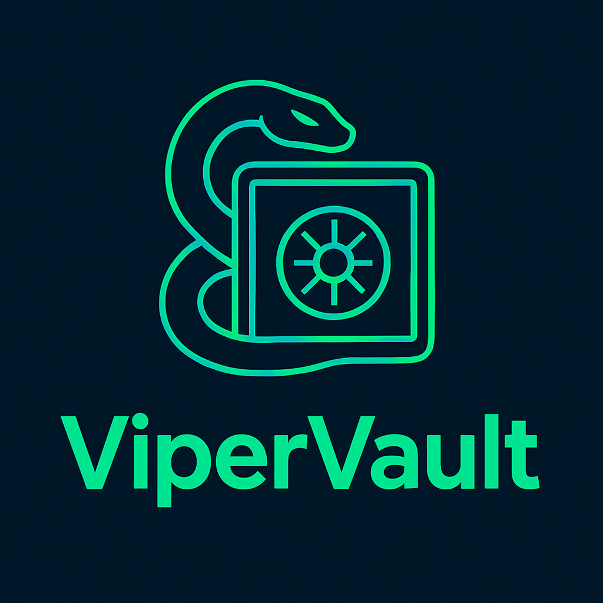

# 🛡️ Requirements
- Secure random password and passphrase generator
- Management of:
    - Passwords
    - Passkeys (WebAuthn compatible)
    - Notes
    - Credit cards
    - ID cards
    - Driver's licenses
    - Passports
    - Bank accounts
    - Wi-Fi credentials
    - SSH keys
    - Crypto wallets
- Multi-vault support
- Master key unlock system
- Secure and automatic backup system (local/exportable/cloud)
- Secure and automatic synchronization between devices
- Multifactor authentication system (2FA, biometrics, passkey)
- Full biometric authentication (fingerprint and facial recognition)
- Optional dark web monitoring (e.g. HaveIBeenPwned API)

---

# 🏗️ Architecture
- Core logic written in **C or Rust** for maximum security, performance, and auditability
- Native apps in **Kotlin** (Android) and **Swift** (iOS)
- Fully degoogled (no Google Play Services, Firebase, etc.) for maximum privacy
- Modular, maintainable, and privacy-preserving design
- Verified and tested for cryptographic correctness

---

# 🔐 Security
- End-to-end encryption (E2EE)
- Zero-knowledge encryption architecture
- Master key for unlocking vaults
- Two-factor authentication (TOTP/HOTP)
- Biometric authentication (FaceID/TouchID/fingerprint)
- Secure backup (encrypted export/local/cloud)
- Secure synchronization (E2EE over TLS)
- Key derivation via Argon2id (OWASP recommended)
- Use of well-audited primitives (Argon2id, XChaCha20-Poly1305)

---

# 💡 UI & UX
- Clean, intuitive and minimal user interface
- Fast and responsive design
- Modern aesthetics
- Offline-first with graceful sync fallback

---

# 🧪 Development Setup

## 💻 Tech Stack
- **Core:** C or Rust
- **Android app:** Kotlin
- **iOS app:** Swift
- Secure storage: platform-native secure storage (Keychain / EncryptedSharedPreferences)
- Crypto engine: bindings to core library (C/Rust)
- Biometrics: Fingerprint / FaceID support
- 2FA: Custom implementation (no Google dependencies)
- Passkeys: WebAuthn compatible (verify platform support)
- Backup/sync: WebDAV or end-to-end encrypted blob sync (custom API)

## 🧪 Testing
- Unit testing: native frameworks + Rust/C tests for core
- Integration/E2E: platform-native tools

## 📦 Package & Dependency Management
- Android: Gradle
- iOS: Swift Package Manager / CocoaPods
- Core: Cargo (Rust) or make/CMake (C)

## 🔐 Configuration
- Platform-specific JSON/TS config
- Environment separation (dev/prod)

## 🔧 Tooling
- IDEs: Android Studio / Xcode / VSCode for core
- Emulators: Android Studio / Xcode simulators
- Git + GitHub

---

# 🛡️ Privacy & Compliance
- Zero-knowledge by design: no user secrets leave the device
- No third-party trackers, analytics, or remote logging
- Open source auditability and reproducibility

---

# 📝 To-do:
- [ ] Vault onboarding and creation
- [ ] Encryption using Argon2id + XChaCha20-Poly1305
- [ ] Modern UI (glassmorphism, animations)
- [ ] Core library implementation in C/Rust
- [ ] Vault entries management (passwords, notes, cards, etc.)
- [ ] Passkeys & Biometric support
- [ ] Backup e Synchronization
- [ ] E2E Security Tests

---

# 📁 Project Structure
```
ViperVault/
├── core/ # C or Rust core library
│ ├── crypto/ # Cryptographic primitives
│ ├── vault/ # Vault management logic
│ └── tests/ # Unit tests for core
├── android/ # Android app (Kotlin)
├── ios/ # iOS app (Swift)
├── assets/ # App icons, splash images, logo, etc.
├── LICENSE # Project license (AGPLv3)
└── README.md # Project documentation
```

---

# 🧰 Tech Stack
- Core library in **C/Rust** for performance and security
- Android app in **Kotlin**
- iOS app in **Swift**
- End-to-end encryption, local-first storage, and modern UX

---

# 📄 License
This project is licensed under the **AGPLv3** license.  
See the [`LICENSE`](./LICENSE) file for full license information.

---

# 👤 Authors
- **Emanuele Relmi** – _Development, UI/UX, Security_  
  GitHub: [Kirito-Emo](https://github.com/Kirito-Emo)